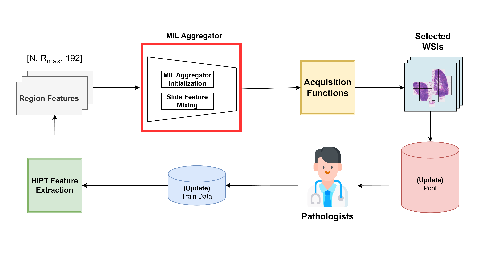
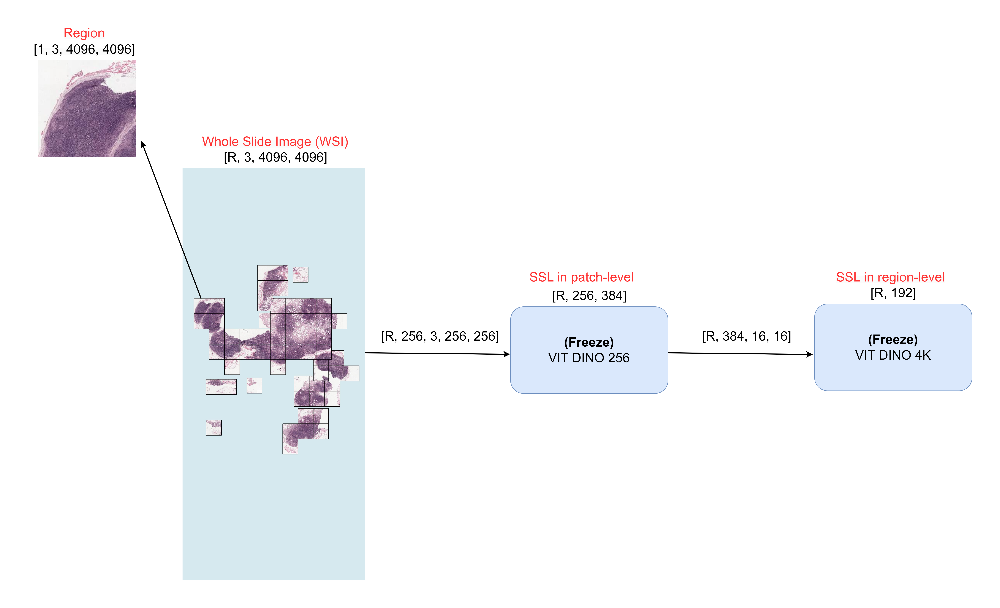
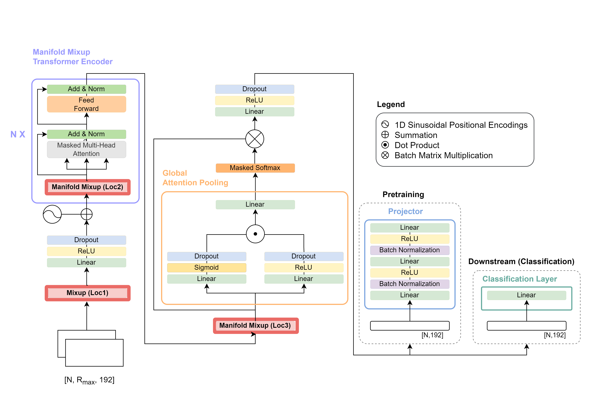

<h1 align="center"> Enhancing whole slide image classification in digital histopathology with slide-level self-supervised
learning and slide feature mixing </h1>

**Official Implementation of CrashMix**

## Overview

- We present *CrashMix*, an innovative framework extending the general MIL framework, specifically building on the hierarchical image pyramid transformer (HIPT)
- Through the integration of the Barlow Twins Slide Mixing technique during pretraining, *CrashMix* adeptly manages diverse WSI sizes, optimizing the utilization of unlabeled WSIs
- Notably, it consistently outperforms HIPT in accuracy during the fine-tuning of the MIL feature aggregator
- Integrated with slide feature mixing, *CrashMix* showcases significant performance improvements across various active learning acquisition functions and WSI labeled training budgets

<p align="center">
  
</p>

## Attribution

This codebase builds upon [HIPT](https://github.com/mahmoodlab/HIPT) and [Re-Implementation HIPT](https://github.com/clemsgrs/hipt)

## Status

This work is currently in the submission phase, awaiting review

## Overall Framework

<p align="center">
  
</p>

Illustration of our experimental settings, showcasing the enhanced active learning approach leveraging region features obtained through HIPT <br>

The key distinction between the baseline and *CrashMix* is the addition of MIL aggregator initialization and slide feature mixing during fine-tuning, whereas the baseline initializes the MIL aggregator from scratch

## Requirements

- python 3.8.16
- install requirements via 

    ```bash
    pip install -r requirements.txt
    ````

## Prerequisite

Extract square regions from each WSI to create a `pretrain` dataset using [HS2P](https://github.com/clemsgrs/hs2p), which segments tissue and extracts relevant regions at a given pixel spacing

The results from HS2P should be structured as follows:

<details>
<summary>
Folder structure
</summary>

```bash
<data_dir>/
├── pretrain/
    ├── hs2p_20x_4096/
        ├── debug/
            ├── patches/
                ├── slide_1/
                    ├── 4096
                        ├── jpg
                            ├── slide_1_x1_y1.png
                            ├── slide_1_x2_y2.png
                            ├── ...
                    slide_2/
                    ├── 4096
                        ├── jpg
                            ├── slide_2_x1_y1.png
                            ├── slide_2_x2_y2.png
                            ├── ...
                    ├── ...
                
```
</details>

Download HIPT pre-trained weights using the following commands:

<details>
<summary>
Download commands
</summary>

```
mkdir checkpoints
cd checkpoints
gdown 1Qm-_XrTMYhu9Hl-4FClaOMuroyWlOAxw
gdown 1A2eHTT0dedHgdCvy6t3d9HwluF8p5yjz
```
</details>

## Feature Extraction

<p align="center">
  
</p>

Create a configuration file under config/feature_extraction/ inspired by existing files <br>
To extract region-level features, set level: 'global' in the config (refer to `config/feature_extraction/global.yaml`)

Ensure that slides_list.txt contains a list of all slide names in a .txt file:
```
slide_1
slide_2
...
```

Run the following command to initiate feature extraction:

```bash
python extract_features.py --config-name global
```

The results should be structured as follow:

<details>
<summary>
Folder structure
</summary>

```bash
outputs/
├── pretrain/
    ├── features/
        ├── hipt/
            ├── global/
                ├── region/
                    ├── slide_1_x1_y1.pt
                    ├── slide_2_x2_y2.pt
                    ├── ...
                ├── slide/
                    ├── slide_1.pt
                    ├── slide_2.pt
                    ├── ...
```
</details>

## MIL Aggregator Initialization: Barlow Twins Slide Mixing

<p align="center">
  
</p>

**1. Prepapre a csv file inside `data/pretrain/` (refer to `data/pretrain/camelyon16_cptac_ucec.csv`)**

This csv list all the slides for pretraining

```
slide_id
slide_1
slide_2
...
```

**2. Create a configuration file under `config/training/` inspired by existing files**

Refer to `config/training/pretrain.yaml` for inspiration

**3. Pretrain Barlow Twins Slide Mixing**

Run the following command to initiate Barlow Twins Slide Mixing:

```bash
python barlow_twins_slide_mixing.py --config-name pretrain
```

The results should be structured as follows:

<details>
<summary>
Folder structure
</summary>

```bash
outputs/
├── pretrain/
    ├── checkpoints/
        ├── global
            ├── <model_name>_<epoch>.pth
            ├── <model_name>_<epoch>.pth
            ├── ...
```
</details>

## Fine-tuning the MIL Aggregator with Slide Feature Mixing

<p align="center">
  
</p>

**1. Prepare pool and test csv files for downstream classification**

Refer to `data/camelyon16/pool.csv` and `data/camelyon16/test.csv`  for inspiration

These two csv files list all the slides for downstream classification

```
slide_id,label
slide_1,0
slide_2,1
...
```

**2. Create a configuration file under `config/training/` inspired by existing files**

Refer to `config/training/global.yaml` for inspiration <br>

Note that the `<model_name>` in the config file should be the full name `<model_name>_<epoch>` <br>

Make sure to include the following to integrate slide feature mixing during fine-tuning, and uncomment if they are not needed
```
mixing:
    mixup: True
    manifold_mixup: True
    manifold_mixup_transformer: True
    mixup_alpha: 1
    mixup_alpha_per_sample: False
    mixup_type: random # [random, cosine_sim, class_aware]
...
```

**3. Fine-tuning MIL aggregator with slide feature mixing**

Run the following command to initiate the fine-tuning process:

```bash
python main.py --config-name global
```

The results should be structured as follows:

<details>
<summary>
Folder structure
</summary>

```bash
outputs/
├── <downstream_dataset>
    ├── checkpoints/
        ├── <all_settings_folder>
            ├── <AL_strategy>
                ├── best_model.pth
    ├── results/
        ├── <all_settings_folder>
            ├── <AL_strategy>
                ├── train_0.csv
                ├── train_1.csv
                ├── ...
                ├── test.csv
                ├── test_results.csv
                ├── roc_auc_curve.png
    ├── scripts/
        ├── <all_settings_folder>
            ├── log.txt
            
```
</details>

`best_model.pth` is the best model given the specified settings and AL strategy <br>
`train_0.csv`, `train_1.csv`, etc., contain the predicted probability over classes <br>
`log.txt` contains all the model's performance metrics (ACC, AUC, Precision, Recall) over all AL strategies and training labeled budgets